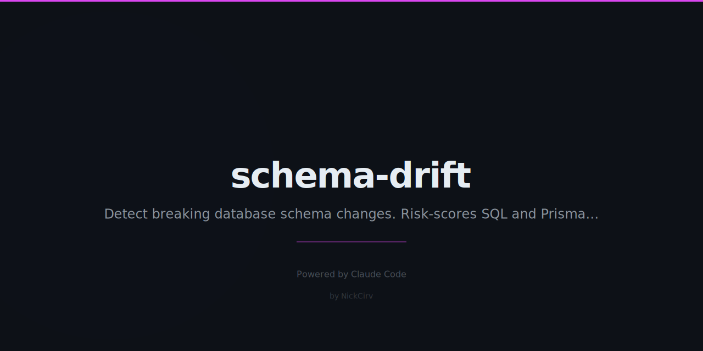

# schema-drift

**Your database schema just changed. Is it safe?**

[](https://www.npmjs.com/package/schema-drift)
[]()
[]()

```
  SCHEMA-DRIFT  v1.0.0

  Comparing schemas...

  ── Tables ───────────────────────────────────
  + orders_archive                              NEW TABLE
  ~ users                                       MODIFIED
  - legacy_sessions                             DROPPED

  ── Column Changes (users) ───────────────────
   BREAKING  email: VARCHAR(100) → VARCHAR(50)  data truncation risk
   CAUTION   name → display_name               renamed (update queries)
   SAFE      avatar_url: TEXT (nullable)        new column added

  ── Index Changes ────────────────────────────
   SAFE      + idx_users_email (users.email)    new index
   CAUTION   - idx_sessions_token               removed (perf regression?)

  ── Risk Summary ─────────────────────────────
  2 BREAKING  │  2 CAUTION  │  3 SAFE

  This migration has BREAKING changes. Review carefully before running.
```

---

## The Problem

Someone pushed a migration. It drops a column. Nobody noticed until production broke.

schema-drift catches that **before** it reaches your database. It reads your schema files, diffs them, and gives every change a risk score — so you can make informed decisions instead of discovering problems at 2am.

---

## Install

```bash
# Run without installing
npx schema-drift old.sql new.sql

# Install globally
npm install -g schema-drift
```

---

## Usage

### Compare two SQL files (default)
```bash
schema-drift old.sql new.sql
```

### Compare two Prisma schemas
```bash
schema-drift --prisma schema.before.prisma schema.after.prisma
```

### Analyze a migration directory
```bash
schema-drift --migrations ./migrations
schema-drift --migrations ./prisma/migrations
```

### Output formats
```bash
schema-drift old.sql new.sql --format md      # Markdown
schema-drift old.sql new.sql --json           # JSON (CI pipelines)
schema-drift old.sql new.sql --md             # Markdown shorthand
```

### CI mode — fail on BREAKING changes
```bash
schema-drift old.sql new.sql --strict
# Exits with code 1 if any BREAKING changes found
```

---

## Supported Formats

| Format | Extension | Notes |
|--------|-----------|-------|
| Raw SQL | `.sql` | PostgreSQL, MySQL, SQLite |
| Prisma Schema | `.prisma` | Models, relations, `@@index` |
| Migration Directory | dir | Prisma-style (`migrations/*/migration.sql`) or numbered files |

---

## Risk Levels

### BREAKING (red)
Changes that **will break** existing data or running applications:

- Column removed
- Column type changed (data truncation risk — e.g. VARCHAR(100) → VARCHAR(50))
- NOT NULL constraint added without a default value
- Table dropped
- Primary key changed
- Foreign key removed (referential integrity gone)

### CAUTION (yellow)
Changes that **might cause problems** — review before applying:

- Index removed (performance regression)
- Default value changed
- Nullable changed to NOT NULL (with default — check existing NULLs)
- New FK added (existing orphaned rows may fail validation)
- New CHECK constraint (existing rows may violate it)

### SAFE (green)
Changes that are safe to apply in most circumstances:

- New table added
- New nullable column added
- New column with a default value
- New index added

---

## CI Integration

Block PRs that introduce BREAKING schema changes:

**GitHub Actions**
```yaml
- name: Check schema safety
  run: npx schema-drift migrations/old.sql migrations/new.sql --strict
```

**Pre-commit hook**
```bash
#!/bin/sh
npx schema-drift migrations/schema_before.sql migrations/schema_after.sql --strict
```

**JSON output for custom tooling**
```bash
schema-drift old.sql new.sql --json | jq '.summary'
# { "BREAKING": 2, "CAUTION": 1, "SAFE": 4 }
```

---

## Why Not Liquibase or Flyway?

Those are **migration runners** — they execute your migrations. schema-drift is a **reviewer** — it tells you whether your migration is safe to run in the first place.

| Tool | Purpose |
|------|---------|
| Flyway / Liquibase | Run migrations, track history |
| schema-drift | Analyze risk BEFORE running |

Use schema-drift in CI to gate migrations. Use Flyway/Liquibase to actually run them.

---

## Example JSON Output

```json
{
  "summary": {
    "BREAKING": 1,
    "CAUTION": 2,
    "SAFE": 3
  },
  "hasBreaking": true,
  "changes": [
    {
      "type": "column_removed",
      "table": "users",
      "column": { "name": "legacy_token", "type": "TEXT" },
      "risk": "BREAKING",
      "reason": "column removed — data loss + query breakage"
    }
  ]
}
```

---

## License

MIT — Nicholas Ashkar, 2026
