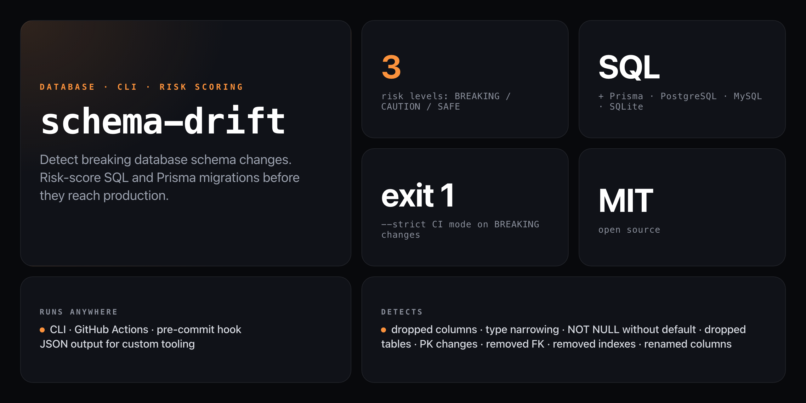

<div align="center">

**Your database schema just changed. Risk-score every alteration before it reaches production.**


</div>

---

A migration that drops a column lives in your git history forever — and in your broken production app until 2am. `schema-drift` diffs two schema states, classifies every change as `BREAKING`, `CAUTION`, or `SAFE`, and exits `1` in CI so the risky migration never gets deployed silently.

```
  SCHEMA-DRIFT  v1.0.0

  Comparing schemas...

  ── Tables ───────────────────────────────────
  + orders_archive                              NEW TABLE
  ~ users                                       MODIFIED
  - legacy_sessions                             DROPPED

  ── Column Changes (users) ───────────────────
   BREAKING  email: VARCHAR(100) → VARCHAR(50)  data truncation risk
   CAUTION   name → display_name               renamed (update queries)
   SAFE      avatar_url: TEXT (nullable)        new column added

  ── Index Changes ────────────────────────────
   SAFE      + idx_users_email (users.email)    new index
   CAUTION   - idx_sessions_token               removed (perf regression?)

  ── Risk Summary ─────────────────────────────
  2 BREAKING  │  2 CAUTION  │  3 SAFE

  This migration has BREAKING changes. Review carefully before running.
```

## Install

No npm account needed — runs straight from GitHub:

```bash
npx github:NickCirv/schema-drift
```

## Usage

### Compare two SQL files

```bash
npx github:NickCirv/schema-drift old.sql new.sql
```

### Compare two Prisma schemas

```bash
npx github:NickCirv/schema-drift --prisma schema.before.prisma schema.after.prisma
```

### Analyze a migration directory

```bash
npx github:NickCirv/schema-drift --migrations ./migrations
npx github:NickCirv/schema-drift --migrations ./prisma/migrations
```

### Output formats

```bash
npx github:NickCirv/schema-drift old.sql new.sql --format md    # Markdown report
npx github:NickCirv/schema-drift old.sql new.sql --json         # JSON (CI pipelines)
npx github:NickCirv/schema-drift old.sql new.sql --md           # Markdown shorthand
```

### CI mode — fail on BREAKING changes

```bash
npx github:NickCirv/schema-drift old.sql new.sql --strict
# Exits with code 1 if any BREAKING changes are found
```

| Flag | Description |
|------|-------------|
| `[old] [new]` | Two schema files to compare (SQL or Prisma) |
| `--prisma` | Parse as Prisma `.prisma` schema files |
| `--migrations <dir>` | Analyze a migration directory (Prisma-style or numbered `.sql` files) |
| `--format <fmt>` | Output format: `terminal` (default), `md`, `json` |
| `--json` | Shorthand for `--format json` |
| `--md` | Shorthand for `--format md` |
| `--strict` | Exit code `1` if any `BREAKING` changes found (CI mode) |

## Supported formats

| Format | Extension | Notes |
|--------|-----------|-------|
| Raw SQL | `.sql` | PostgreSQL, MySQL, SQLite |
| Prisma Schema | `.prisma` | Models, relations, `@@index` |
| Migration Directory | dir | Prisma-style (`migrations/*/migration.sql`) or numbered files |

## Risk levels

### BREAKING
Changes that **will break** existing data or running applications:

- Column removed
- Column type narrowed (e.g. `VARCHAR(100)` → `VARCHAR(50)`)
- `NOT NULL` constraint added without a default value
- Table dropped
- Primary key changed
- Foreign key removed

### CAUTION
Changes that **might cause problems** — review before applying:

- Index removed (performance regression risk)
- Default value changed
- Column renamed
- New `FK` added (existing orphaned rows may fail validation)
- New `CHECK` constraint (existing rows may violate it)

### SAFE
Changes that are safe to apply in most circumstances:

- New table added
- New nullable column added
- New column with a default value
- New index added

## CI integration

Block PRs that introduce BREAKING schema changes:

**GitHub Actions**
```yaml
- name: Check schema safety
  run: npx github:NickCirv/schema-drift migrations/old.sql migrations/new.sql --strict
```

**Pre-commit hook**
```bash
#!/bin/sh
npx github:NickCirv/schema-drift schema_before.sql schema_after.sql --strict
```

**JSON output for custom tooling**
```bash
npx github:NickCirv/schema-drift old.sql new.sql --json | jq '.summary'
# { "BREAKING": 2, "CAUTION": 1, "SAFE": 4 }
```

## What it is NOT

- **Not a migration runner.** Tools like Flyway or Liquibase execute your migrations. `schema-drift` reviews whether they are safe to run in the first place — use both together.
- **Not a schema linter.** It compares two schema states; it does not enforce naming conventions or style.
- **Not a guarantee.** Risk classification is based on structural analysis. Always review `CAUTION` items manually — context matters.

---

<div align="center">
<sub>Node 18+ · MIT · by <a href="https://github.com/NickCirv">NickCirv</a></sub>
</div>
